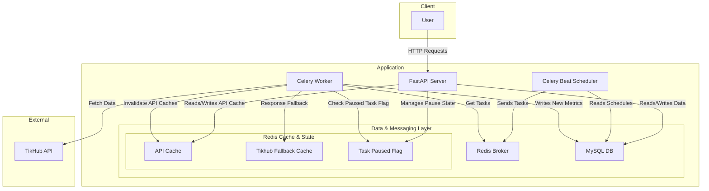

# Instagram Monitoring System

# 1. High-level Plan

## a. Define Technologies and Architecture
- FastAPI: API
- MySQL: database
- SQLAlchemy: ORM
- Redis: Caching and Celery broker
- Celery: Task queue for background jobs
- TikHub API: Data source
- Pytest: Testing framework

## b. Data Modeling

### [DB diagram](https://dbdiagram.io/d/instagram_monitor-684f982e3cc77757c8fcacd9)

```sql
// --- Enums ---

enum task_type_enum {
  influencer
  post
}

enum task_status_enum {
  active
  paused
  stopped
}


// --- Tables --- 

Table influencer_metrics_history {
  id integer [pk, increment, note: 'Unique identifier for the history record.']
  user_id bigint [not null, note: 'The numeric user ID from Instagram.']
  username varchar(255) [not null, note: 'The user\'s Instagram handle.']
  bio text [note: 'The user\'s biography.']
  follower_count integer [note: 'Number of followers at the time of recording.']
  following_count integer [note: 'Number of accounts the user is following.']
  post_count integer [note: 'Total number of posts.']
  recorded_at datetime [default: `now()`, note: 'Timestamp of when the metrics were fetched.']

  Indexes {
    (user_id, recorded_at) [note: 'Optimizes fetching a user\'s history.']
  }
}

Table post_metrics_history {
  id integer [pk, increment, note: 'Unique identifier for the history record.']
  post_code varchar(50) [not null, note: 'The shortcode from the post URL.']
  post_id varchar(50) [not null, note: 'The unique ID assigned by Instagram.']
  like_count integer [note: 'Number of likes at the time of recording.']
  comment_count integer [note: 'Number of comments at the time of recording.']
  play_count integer [note: 'Number of plays (For videos only).']
  recorded_at datetime [default: `now()`, note: 'Timestamp of when the metrics were fetched.']

  Indexes {
    (post_code, recorded_at) [note: 'Optimizes fetching a post\'s history.']
  }
}

Table task {
  id varchar(36) [pk]
  task_type task_type_enum [not null]
  username varchar(255) [unique, note: 'Links implicitly to influencer_metrics_history.']
  post_code varchar(255) [unique, note: 'Links implicitly to post_metrics_history.']
  interval_seconds integer [not null]
  status task_status_enum [not null]
  created_at datetime [default: `now()`]
  updated_at datetime [default: `now()`]

  Indexes {
    (task_type) [note: 'Optimizes finding tasks by their type (influencer vs. post).']
    (status)
  }
}

```

## c. System Architecture

### Architectural Blueprint:
  - API Layer: API Backend interacts with MySQL and Redis. For user history requests, it retrieve the Redis first and use that cached results history. But if the history does not exist in Redis, then retrieve history from MySQL database and write that result to Redis Cache with dynamic TTL (time to live) as monitoring interval of that task.
  And for pausing task request, it set that task pause flag as true in Redis and update status in the MySQL database.
  - Celery Beat Scheduler: Scheduler should be run in every scheduled timeframe and retrieve task for that schedule timeframe from MySQL and sent those tasks to Redis broker.
  - Redis as broker: This used for asynchronous communication between Celery Beat Scheduler and Celery worker.
  - Celery Worker: This subscribe scheduled tasks from Redis broker and execute that task. Before start executing the task, worker first check the paused flag of that task from Redis, and if that flag is true in Redis, then stop executing that task and move on to others. While executing tasks, worker fetch the instagram data from TikHub API. and after successful data retrieval, worker store that response data to Redis cache with dynamic TTL like (3 * interval) so that we can use that data as fallback when we failed from TikHub API because of rate limit or downtime. and after successful retrieve for the certain data from data source, worker try to delete record for that response key from Redis history cache if it's already set from the API for cache invalidation purpose. Eventually update history data in MySQL.
  - MySQL Database: permanent source of truth
  - Redis as Caching and state management: used for Cache of user history or post history data with dynamic TTL to optimize the history data retrieval from API. And also used Cache as fallback method for Tikhub api response. 
  used to store the paused state of the tasks so that we can quickly stop the task execution from worker. 
  - External API Integration (TikHub): external data source

### Data Flow


## d. API Design
### Influencer APIs
#### - Create a new influencer monitoring task.
- method: `POST`
- url: `/api/v1/instagram/influencer_monitor/create_monitor_task`
- Request body
```json
{
  "username": "instagram",
  "interval": "1h" // Enum: "30s", "30m", "1h", "1d", "7d"
}
```
- Success response
```json
{
  "status_code": 201,
  "success": true,
  "data": {
    "task_id": "e4a2f8b9-5f21-4b13-b2f7-5f7a1d3b0e5c",
    "username": "instagram",
    "status": "active",
    "interval_seconds": 3600
  }
}
```

#### - Retrieve historical data for a monitored user.
- method: `GET`
- url: `/api/v1/instagram/influencer_monitor/user_history/{user_id}`
- Success response
```json
{
  "status_code": 200,
  "success": true,
  "data": {
    "username": "instagram",
    "history": [
      {
        "follower_count": 690957359,
        "following_count": 167,
        "post_count": 8047,
        "bio": "Discover what's new on Instagram",
        "recorded_at": "2023-10-27T10:00:00Z"
      },
      {
        "follower_count": 690957359,
        "following_count": 160,
        "post_count": 8046,
        "bio": "Discover what's new on Instagram",
        "recorded_at": "2023-10-26T10:00:00Z"
      }
    ]
  }
}
```

#### - List all influencer monitoring tasks.
- method: `GET`
- url: `/api/v1/instagram/influencer_monitor/tasks`
- Success response
```json
{
  "status_code": 200,
  "success": true,
  "data": [
    {
      "task_id": "e4a2f8b9-5f21-4b13-b2f7-5f7a1d3b0e5c",
      "username": "instagram",
      "status": "active",
      "interval_seconds": 3600,
      "created_at": "2023-10-27T10:00:00Z",
      "updated_at": "2023-10-27T10:00:00Z"
    },
    {
      "task_id": "ed5bacbc-86c8-4575-9d2f-444e2ad2952f",
      "username": "instagram1",
      "status": "paused",
      "interval_seconds": 3600,
      "created_at": "2023-10-27T11:00:00Z",
      "updated_at": "2023-10-27T11:00:00Z"
    }
  ]
}
```

#### - Stop one or more monitoring tasks.
- method: `POST`
- url: `/api/v1/instagram/influencer_monitor/stop_tasks`
- Request body
```json
{
  "task_ids": ["ed5bacbc-86c8-4575-9d2f-444e2ad2952f"]
}
```
- Success response
```json
{
  "status_code": 200,
  "success": true,
  "data": {
    "deleted_task_ids": ["ed5bacbc-86c8-4575-9d2f-444e2ad2952f"],
  }
}
```


#### - Get status for a specific monitoring task.
- method: `GET`
- url: `/api/v1/instagram/influencer_monitor/task_status/{task_id}`
- Success response
```json
{
  "status_code": 200,
  "success": true,
  "data": {
    "status": "active",
  }
}
```

#### - Pause a monitoring task.
- method: `POST`
- url: `/api/v1/instagram/influencer_monitor/pause_task/{task_id}`
- Success response
```json
{
  "status_code": 200,
  "success": true,
  "data": {
    "task_id": "e4a2f8b9-5f21-4b13-b2f7-5f7a1d3b0e5c",
    "status": "paused",
  }
}
```


#### - Resume a paused monitoring task.
- method: `POST`
- url: `/api/v1/instagram/influencer_monitor/resume_task/{task_id}`
- Success response
```json
{
  "status_code": 200,
  "success": true,
  "data": {
    "task_id": "e4a2f8b9-5f21-4b13-b2f7-5f7a1d3b0e5c",
    "status": "active",
  }
}
```

### Post APIs
#### - Start tracking a given post.
- method: `POST`
- url: `/api/v1/instagram/post_monitor/create_monitor_task`
- Request body
```json
{
  "post_url": "https://www.instagram.com/p/CxYQJO8xuC6/",
  "interval": "1h" // Enum: "30s", "30m", "1h", "1d", "7d"
}
```
- Success response
```json
{
  "status_code": 201,
  "success": true,
  "data": {
    "task_id": "e4a2f8b9-5f21-4b13-b2f7-5f7a1d3b0e5c",
    "post_code": "CxYQJO8xuC6",
    "status": "active",
    "interval_seconds": 3600
  }
}
```

#### - Retrieve historical engagement data for the post.
- method: `GET`
- url: `/api/v1/instagram/post_monitor/video_history/{post_code}`
- Success response
```json
{
  "status_code": 200,
  "success": true,
  "data": {
    "post_code": "CxYQJO8xuC6",
    "history": [
        {
          "like_count": 54321,
          "comment_count": 123,
          "play_count": 543210,
          "recorded_at": "2023-10-27T10:30:00Z"
        }
    ]
  }
}
```

#### - List all post monitoring tasks.
- method: `GET`
- url: `/api/v1/instagram/post_monitor/tasks`
- Success response
```json
{
  "status_code": 200,
  "success": true,
  "data": [
    {
      "task_id": "e4a2f8b9-5f21-4b13-b2f7-5f7a1d3b0e5c",
      "post_code": "CxYQJO8xuC6",
      "status": "active",
      "interval_seconds": 3600,
      "created_at": "2023-10-27T10:00:00Z",
      "updated_at": "2023-10-27T10:00:00Z"
    },
  ]
}
```

#### - Stop one or more post monitoring tasks.
- method: `POST`
- url: `/api/v1/instagram/post_monitor/stop_tasks`
- Request body
```json
{
  "task_ids": ["ed5bacbc-86c8-4575-9d2f-444e2ad2952f"]
}
```
- Success response
```json
{
  "status_code": 200,
  "success": true,
  "data": {
    "deleted_task_ids": ["ed5bacbc-86c8-4575-9d2f-444e2ad2952f"],
  }
}
```


#### - Check the status of a post monitoring task.
- method: `GET`
- url: `/api/v1/instagram/post_monitor/task_status/{task_id}`
- Success response
```json
{
  "status_code": 200,
  "success": true,
  "data": {
    "status": "active",
  }
}
```

#### - Pause tracking for a post.
- method: `POST`
- url: `/api/v1/instagram/post_monitor/pause_task/{task_id}`
- Success response
```json
{
  "status_code": 200,
  "success": true,
  "data": {
    "task_id": "e4a2f8b9-5f21-4b13-b2f7-5f7a1d3b0e5c",
    "status": "paused",
  }
}
```


#### - Resume tracking for a paused post task.
- method: `POST`
- url: `/api/v1/instagram/post_monitor/resume_task/{task_id}`
- Success response
```json
{
  "status_code": 200,
  "success": true,
  "data": {
    "task_id": "e4a2f8b9-5f21-4b13-b2f7-5f7a1d3b0e5c",
    "status": "active",
  }
}
```


### Document API specifications
- Swagger Doc

# 2. Implementation Plan
- [ ] Initialize project structure and configure development environment
  - Set up virtual environment
  - Create requirements.txt with all dependencies
  - Set up Docker and docker-compose for local development
  - Configure environment variables
- [ ] Implement database models using SQLAlchemy
  - Create base models
  - Implement influencer models
  - Implement post monitoring models
  - Add database migrations using Alembic
- [ ] Core Infrastructure Setup
  - Set up FastAPI application structure
  - Configure Redis
  - Set up Celery
- [ ] API Development
  - Implement Influencer Monitor API
  - Implement Post Monitor API
- [ ] Celery Scheduler implementation
  - Fetch tasks from Database
  - Push to Redis broker
- [ ] Background Task Implementation
  - Pull tasks from Redis broker
  - Check task paused flag from Redis
  - Fetch data by integrating with TikHub API
  - Store result to Redis cache as fallback
  - Store history to MySQL
  - Delete Redis cache for history
- [ ] Testing
  - Configure pytest
  - Write unit testing
    - database models
    - API endpoints
    - celery tasks
- [ ] Documentation
  - Architectural Documentation
  - API documentation with Swagger


# 3. Improvement
- Security
  - Implement rate limiting
  - Add authentication
